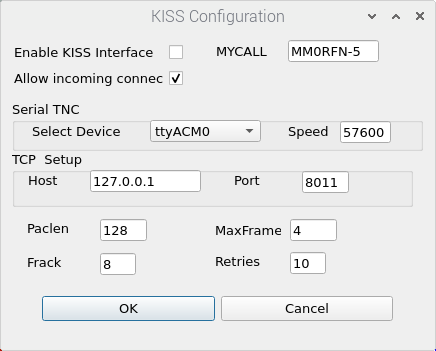
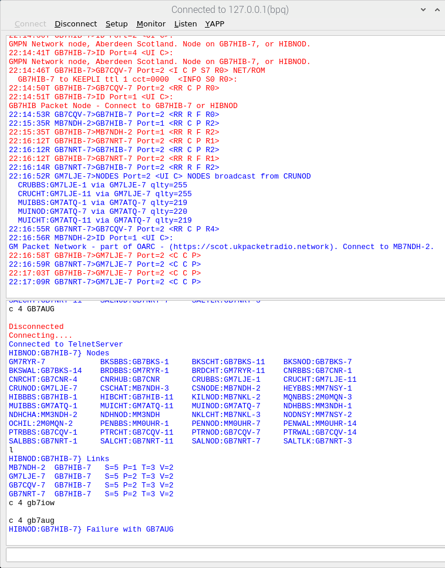
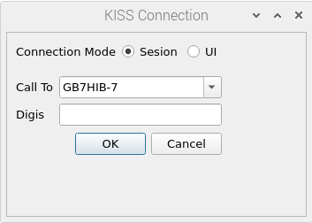
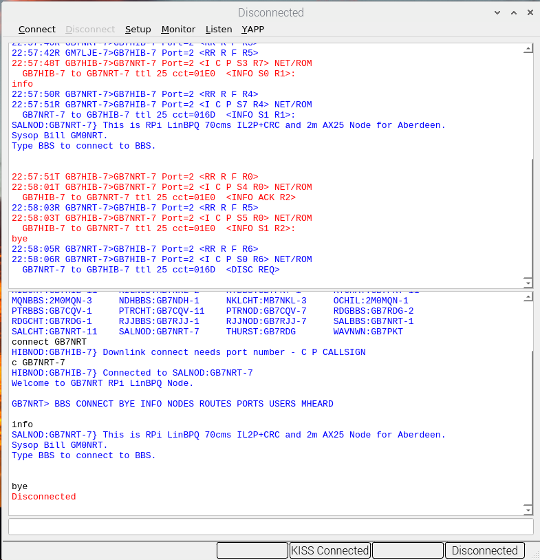

# Beginner's Guide

## Key Concepts

In packet radio, we connect our computers together over the air to transmit data wirelessly. As it's not as polished as Wifi (but much more fun), there are a few things you'll need to be familiar with before you can get stuck in to the network.

### Equipment

You'll need a Radio and a computer with a cable to connect them together. Sometimes these are easy to buy online, and the more adventurous can make them. If you've done [FT-8](https://en.wikipedia.org/wiki/FT8) or another data mode, you might already have this cable.

Learn more about some Radio equipment [here](equipment/index.md).

### Modem

You'll need a modem of some variety. For more advanced users this of often a piece of hardware such as a [NinoTNC](modems/ninotnc.md), but as a beginner you're likely better served with a piece of software such as [QtSoundModem](modems/qtsm.md). As the software costs nothing and takes no time to be delivered, it's quicker to get started with! No lunch is free, however, so this simpler starting point brings with it more configuration complexity!

Learn more about modems [here](modems/index.md)

### Client Software

You'll need a client of some form to be able to connect to the network. I would recommend [QtTermTCP](clients/qtttcp.md) to start with. Again, it's free and it works with QtSoundModem, a NinoTNC and other hardware & software offerings too.

### Addresses

Every station on the network has an address. The Government issued yours when you passed your ham exam (or if you've not sat it, they will do once you pass!) - it's simply your callsign. My station, as an example, is MM0RFN on the air.

Sometimes, when we want to offer a service from our computer, such as a messageboard or chatroom, we will add a number afterwards. We call this an SSID, a Service Set IDentifier. Due to the limitations of AX.25, we can have from number 1 to 15. 

If you want to connect to my messageboard, you can tell your client to connect straight to MM0RFN-1, or if you want to connect to my chatroom it might be MM0RFN-4. 

SSIDs are not necessary - some stations have a frontend that will let you choose what service you want to use when you connect.

When you call your local node or a nearby station, it is most likely they will have an SSID that you'll need to use.

### Modes

Similar to normal radio, we have different Modes too. 

Instead of AM, FM, etc, we break to them down to 3 categories:

  * Protocol: How our data is encoded
  * Speed: How fast our data will travel
  * Modulation: what manner of sound we generate to achieve communication

Both stations must use the same protocol, speed and modulation to communicate on a shared frequency.

You can see a good table of Protocols, Speeds and Modulations at [NinoTNC](modems/ninotnc.md#mode-switch) once you've digested the below and feel brave!

#### Protocol

We use two main protocols: AX.25 (legacy) and IL2P (modern).

##### AX.25

AX.25 is an umbrella term often used for all packet radio, but really it refers to the specification written between the 70s and 90s that defines the basics of packet.

It has a long legacy and is rather simple, but is reliable, embedded in a lot of old hardware and will likely be in use until the heat death of the universe.

Learn more [here](https://en.wikipedia.org/wiki/AX.25).

##### IL2P

IL2P, the 'Improved Layer 2 Protocol' is by Nino KK4HEJ and is an evolution of AX.25. It includes nice things such as error correction of data and allows for, theoretically, more reliable communications but isn't compatible with AX.25 on the air.

There are a number of varieties of IL2P in the wild too, most commonly 'With CRC' which includes a check that callsigns are valid.

#### Speeds

We often use '1200', '1200bd' or similar as shorthand for how fast our data is sending and received. The 'bd' is baud, or the number of 'symbols' transmitted a second. For most of our communications, 1 baud is equivalent to 1 bit per second, however more exotic modulation can transmit more than one symbol at a time, buying us more speed! 

We use 3 broad speed categories at the moment:

  * Low - 300bd - used on HF
  * Medium - 1200bd - used on VHF
  * High - 9600bd - used on UHF and beyond

Nothing comes for free, and speed is normally proportional to your channel bandwidth. 300bd fits into quite a narrow space, 5-600Hz, which is why we use it on HF. 1200bd and other medium speed up to and including 4800bd are used in 12.5kHz FM channels, so appear on VHF and UHF. 9600bd and faster need 25kHz FM and higher channels. 

#### Modulation

Modulation is a little more complicated than the others as there are many ways to modulate a signal!

If you've played with data modes on a radio already, you will have a reasonable feeling for this.

The key modulations we use are:

**AFSK**

Audio Frequncy Shift Keying - Multiple audible tones. This is commonly found on VHF, FM 1200bd links. Classic bleeps and bloops that have been heard on our frequencies for decades. Tune to 144.800MHz to get a flavour from the APRS network.

**FSK**

Frequency Shift Keying - Multiple tones, not necessarily audible. Commonly found on UHF, FM 9600bd links. This sounds quite like white noise and can be difficut to differentiate from unsquelched audio.

**PSK**

Phase Shift Keying - Data encoded into changes of phase. Often found on HF links.

### Linux

A key component of the systems I'll be discussing in this guide is Linux. If you don't have a great understanding of Linux or it's a bit scary, I've written a primer [here](linux.md).

There's a lot to take in, and it can seem overwhelming at first, but feel free to read, ask for help and keep in mind that it's easy to feel lost when you approach anything new - there are just so many things to grasp.

A simple starting point is a [Raspberry Pi](https://raspberrypi.org) - it will be a dedicated computer for just packet exploration, and if everything is broken you can easily start again without losing any importnt data - you just rewrite the SD card and start again.

## Radio Set Up

Find out your local packet radio frequency first, and tune your radio to see if you can hear any activity. This will be a good indicator as to whether you need to think about HF instead of VHF/UHF.

If you're in the UK, this will be listed at [ukpacketradio.network](https://nodes.ukpacketradio.network/packet-network-map.html) or  [UKRepeater](https://ukrepeater.net/packetlist.html).

If information is available online, also take note of the details of the mode as this will come in handy setting up your modem.

## Software Set Up

I'm going to assume that you have a NinoTNC or other KISS hardware modem. If you want to use QtSoundModem, take a look at my [guide](modems/qtsm.md).

### Installation

If you're using Debian, Ubuntu or a Raspberry Pi it will be easiest if you install [hibby's repo](repo.md).

Once you have done that you can install the prerequisites - QTTermTCP.

If you're a new user, I recommend using a graphical 'app store' - see how [here](linux.md/#graphical-app-store-frontend).

If you're more linux aware? `apt install soundmodem` in your terminal of choice!

### Configure QtTermTCP

Open QtTermTCP and set up a Kiss Connection to your Modem. This will work for QtSoundModem or a physical modem.

#### Set up Kiss Connection

Click Setup then KISS Configuration. You will be presented with a window that looks similar to the below:

Ensure 'Enable Kiss Interface' is selected, put your callsign in MYCALL and put select your modem from the 'Serial TNC' dropdown. If using a NinoTNC, the speed will be 57600.

Press OK to save settings.

At this stage, I recommend Monitoring the frequency to see if you can decode any information. Local stations will likely be beaconing and this is a good way to test you have set up correctly without interfering with other users transmissions.

Decoded data shall look like:

## Connect

Press Connect, then 'Kiss Connect' in the dropdown menu. You'll see something aking to the below - selection session, enter the callsign & SSID you are trying to connect to, for example GB7HIB-7 if you're connecting to my node. Ignore digipeters for the moment - they can be a future challenge.

You should be presented with some choices in the bottom pane - BBS, Links, Info etc. If not, type `?` in the bottom text box, hit enter and see what the remote system returns with.

Congratulations, you are on the air!

Not seeing anything in the monitor pane? Time to get debugging!

## Debugging

This is where most of my time is spent when setting up packet radio stuff. In my opinion, it's where the real learning happens - you need to get your hands dirty with your radio, with your modem, with linux and try to retain your sanity at the same time. 

Don't worry - there is always something you've forgotten to do, or think you've looked at and haven't. We all have that feeling. Sometimes I keep a note of what I've done and what I've looked at to avoid replication of work, or so I can note what I *have* changed and what I might need to replicate.

### Debugging Checklist

Learn more about debugging:

  * [Your Radio](modems/qtsm.md#check-the-radio)
  * [QtSoundModem](modems/qtsm.md#check-the-audio-coming-in-is-at-the-right-volume)

### Ask for Help!

It is easy to feel overwhelmed and alone as you struggle through debugging your system. Feel free to ask the community for help! No question is stupid, and we all started knowing nothing about this. Everyone is excited to have new stations and nodes to connect to, so will be thrilled to offer some form of pointer, assistance, input or advice. 

!!! note

    Please note, advice is a form of nostalgia: dispensing it is a way of fishing the past from the disposal, wiping it off, painting over the ugly parts and recycling it for more than it's worth.

There are a few great sources of assistance, some will be faster than others to get responses from:

  * General help and chatter on all things packet: [Online Amateur Radio Club Discord](https://oarc.uk)
  * UK Packet Radio Users: [uk packet radio mailing list](https://groups.io/g/ukpacketradio/)
  * QtTermTCP and QtSoundModem help: [bpq32 mailing list](https://groups.io/g/bpq32/)
  * XROUTER help: [XROUTER mailing list](https://groups.io/g/xrouter)
  * NinoTNC: [NinoTNC mailing list](https://groups.io/g/ninotnc/)
  * My Inbox - see the [about page](about.md). I'll be thrilled if you get stuck and sent me an email saying you'd tried this and nothing worked!
