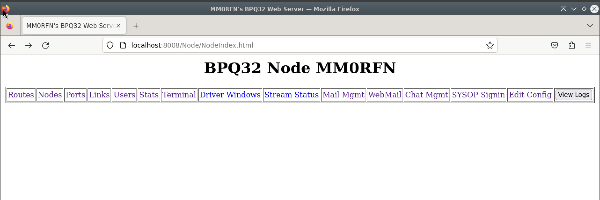

# BPQ

I assume you have already [installed](../install/bpq.md) bpq from the repo.  

## Configuration File

The configuration file I ship in the repo, there are hopefully some obvious fields to fill out. Once all the below holes are filled, you should be able to log in either with [QtTermTCP](../clients/qtttcp.md) or in your web browser at 127.0.0.1:8008, assuming you're on the same computer as the node. 

| Field | Example | Purpose
| ----- | ------- | -------
| NODECALL | MM0RFN | The callsign your node shall identify as
| NODEALIAS | RFNNOD | The alias a calling NET/ROM station can use to connect directly to you
| LOCATOR | IO87dc | A 6 figure Maidenhead square where you are
| PASSWORD | test123 | A sysop password for configuration activities
| AUTOSAVE | 1 | Autosave the NET/ROM Nodes Table on shutdown 
| NODESINTERVAL | 30 | Interval between NET/ROM NODES broadcasts in minutes
| MINQUAL | 50 | The minimum quality of NET/ROM node included in your NODES broadcasts.
| CTEXT | `Hi you look great! ***` | Text displayed when a user connects

### Ports

Port configs in BPQNode aren't too complicated. A common Gotcha is that you configure a port specific broadcast and end up double-broadcasting, both the node master broadcast and the port specific one. 

#### KISS

A common port entry for a [NinoTNC](../modems/ninotnc.md) specifically (but also, more generally, a KISS Modem) looks like:

```
PORT
  PORTNUM=1
  ID=VHF
  TYPE=ASYNC
  PROTOCOL=KISS
  KISSOPTIONS=ACKMODE
  COMPORT=/dev/ttyACM0
  SPEED=57600
  FRACK=4000
  PACLEN=150
  DIGIFLAG=0
  QUALITY=192
  MINQUAL=20
ENDPORT
```

Key settings to observe are the `COMPORT`, which should be the serial port of the device, and `SPEED`. For a NinoTNC this is always 57600, but for QtSoundModem, Direwolf or older hardware may be 9600 or something else. Check your modem configuration!

`QUALITY` sets the assumed quality of connections coming in - I recommend higher quality (up to 200) for higher speed links. Setting this to 0 will disable NET/ROM on the port, and this is current recommended standard practise on HF within the UK Packet Radio Network.

#### Telnet

BPQ's Telnet Port sets the TCP Ports for Telnet, FBB and HTTP connetions, alongside the username and password. This will come in useful when using [QtTTCP](../clients/qtttcp.md) as a monitor and control application.

```
PORT
  PORTNUM=9
  ID=Telnet
  DRIVER=Telnet
  CONFIG
    LOGGING=1
    CMS=1
    DisconnectOnClose=1
    TCPPORT=8010
    FBBPORT=8011
    HTTPPORT=8008
    LOGINPROMPT=user:
    PASSWORDPROMPT=password:
    MAXSESSIONS=10
    CTEXT=Thanks for connecting\n Enter ? for list of commands\n\n
    USER=username,xxxxxxxx,m0aaa,,SYSOP
ENDPORT
```

`USER` is the key configuration to change here - change `username` to your desired administrator username,  `xxxxxxx` to the password and `m0aaa` to the callsign of the administrator.

## Mail Configuration

Mail configuration isn't easy to get your head round! I'm still not clear on it
all, and I think many others are in the same boat. It's done through the browser
instead of on the command line, which makes it slightly more approachable.

Navigate to `http://localhost:8008`, assuming your HTTPPORT is set to 8008. This
will present you with the below view:



Select 'Mail Mgmt' and log in with the details you put in `USER`. The starting
point here is 'Configuration'.

### Configuration to Send & Receive

The configuration tab is your starting point. You need a 'Hierarchical'
address, this will tell other systems where you are and help the network send
things to you. It's similar to the domain of your email, like `@gmail.com`.

Set your BBS call - this will either be your personal callsign or an allocated
GB7xxx series callsign from the ETCC.

Hierarchical addresses in the UK take the following format:

`#xx.GBR.EURO`

Where xx is a number that defines your region. You can find your region with
[this map]().

I recommend unticking `Send System Msgs to SYSOP call` and ticking `Don't hold
Messages From New Users`.

### Forwarding to Neighbours
### Users


