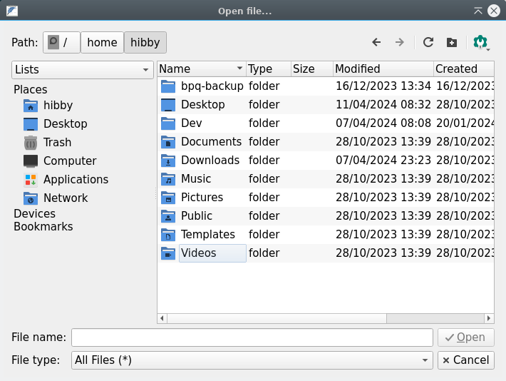
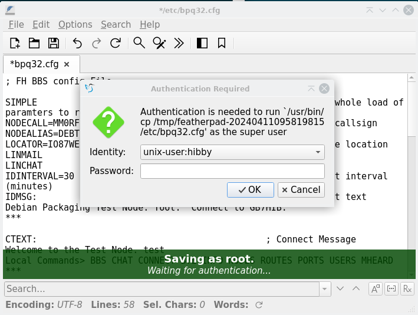
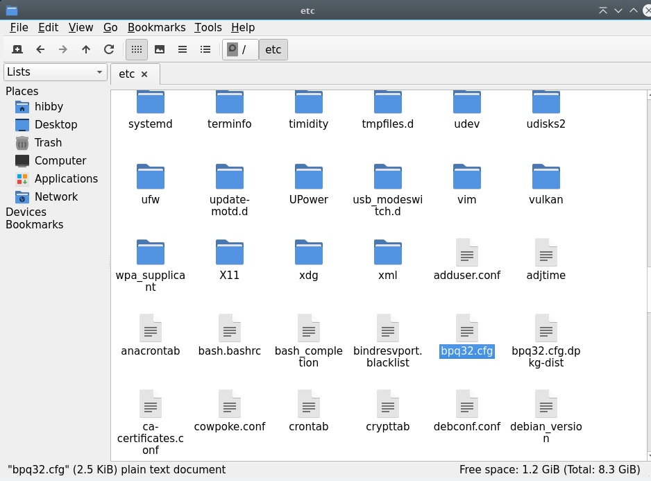

# Linux Primer

My packet radio guide is focussed on running software on Linux and it probably assumes a base level of knowledge. I shall dispense some thoughts and you can judge whether this is helpful.

!!! note

    For those of you with greater background knowledge and opinions, you'll notice I'm painting in broad brushstrokes. This is intentional, don't bite my head off!

## What is Linux?

Linux is, in general terms, a family of operating systems that share a common core set of software and exhibit similar characteristics. It is no one simple thing, and doesn't fit in one neat category.

It can be seen as an alternative to Windows, MacOS, DOS, FreeBSD etc on the desktop - there are many similarities and many differences.

It is built collaboratively by enthusiast and professional software developers in the spirit of freely sharing and improving the world for all humans - in this sense, there is a strong overlap with the goals of man radio amateurs.

Through this guide I will regularly refer to "[Debian](https://debian.org)" - this is the 'Distribution' of Linux that I work on in my free time. A distribution is a collection of software maintained by a group of people. In the case of Debian, there's around 1000 of us. 

As the source code is available for all to see and use due to permissive licenses, if another group has an opinion which differs from the team producing a distribution, they can use our work as a foundation and build something different and new based on that - we call this 'forking'. This is what [Ubuntu](https://ubuntu.com) is, and why we refer to Ubuntu as a 'Debian Derivative'. It's also why 90% of tutorials that target Ubuntu will work for Debian and vice versa. We share common components and building blocks. Raspberry Pi OS falls into this category too - they are standing on Debian's shoulders and commonly re-base their system on ours, so that they can focus their efforts on making the Raspberry Pi work well instead of getting bogged down in tangential detail.

An alternative to Debian and its derivatives is [Fedora](https://www.fedoraproject.org) - while this shares many common components and code at the core of the system, some of the tools used in Fedora differ to such an extent that software built for it can't be guaranteed to run on a Debian based system - similar to Mac vs Windows.

There are hundreds, if not thousands, of Linux Distributions all with different goals. Some are derivatives focussed on a specific task, some are very General and left to you to configure and use. Some are even delivered as code and you need to compile it from the ground up.


## Desktops and Terminals

There's a common misconception that Linux is for command line users only, or that you need to be proficient in the command line to be able to drive it. This is no more true in Linux than it is for MacOS and Windows - there are a number of tasks that some may find more efficient to do via the command line interface (CLI), but there are usually multiple ways to skin the cat. 

Most of my advice will take the form of things to run in the command line, but I am endeavouring to diversify so things are more approachable. 

If you're running the Raspberry Pi, it's most likely you have [Raspberry Pi OS](https://www.raspberrypi.com/software/) with a desktop - there'll be a background, a menu in the top left etc. It might not look familiar, but to a keen explorer it should look approachable at the very least.

If you're running Debian, during install we'll ask you what graphical desktop environment you want to install, if any. As a beginner, I strongly recommend [KDE](https://kde.org) - it is most Windows like and is pretty full featured. If you're running Ubuntu, typically you install an Ubuntu derivative focussed on a specific desktop environment - perhaps [Kubuntu](https://kubuntu.org) for KDE.

## Applications and Repositories

Most Linux distributions are not only just the system and the desktop, but they are shipped with a vast catalogue of applications too. They might not be installed, and you'll need to use some sort of app store tool to install, remove etc applications. It's just like every modern mobile phone - they stole the idea from us!

We call this tool a package manager (we often call applications 'packages'), and a collection of applications is known as a repository, or repo. The Debian family use a program called `apt` as its package manager, and it ships with quite a large repository of apps you can choose from. Most guides, mine included, don't focus on showing you a usable app-store, just a method of installing from a repository.

You might want to add another repository if to get access to additional software, new software that isn't shipped by the distribution's maintainers or some other reason. I keep more up to date versions of software in my repository than Raspberry Pi OS offers, and I have additional software that isn't offered by RasPi OS too.

### Install from the Command Line

To install from the command line, the standard command would be `apt install x` where x is any application you're looking for. This is often prefixed with `sudo`, see below in 'Users, Permissions and sudo' to learn more about why.

### Graphical App Store Frontend

Instead of using `apt install x`, it is possible to run a graphical piece of software. One I recommend is 'Synaptic' - you might have it installed already, or you might have to quickly run `apt install synaptic` in the command line to get yourself the software. 

Have a little look through your application launcher to see if there is an app catalogue, application store, package list or similar.

## Filesystem Layout

In a Windows system, the very top of your computer's filesystem is most often the C Drive, represented as C: commonly. Windows also neatly shows other drives as similar folder structures - CD Drives often start at D:, Floppy drives at A:.

In Linux we follow a documented filesystem hierarchy, starting at the root of the drive, commonly labelled as `/`. Everything else on the system is presented as a file or a folder under `/`. This includes CD Roms, Hard drives which present as folders, serial & USB devices which present as files and more.

Paths always start with a `/`, and if it's a folder it will end with a `/` to indicate there is more depth below.

Devices, as they present, are often named by the class of device and a number starting at 0 to indicate which number it is. You'll commonly see references to `eth0`, showing the first ethernet device or `wlan0` showing the first wireless internet adaptor. A second would be `wlan1` etc. 

If I look at my root filesystem, I see the following folders:

```
❯ ls /
bin@   dev/  home/  lost+found/  mnt/  proc/  run/   srv/  tmp/  var/
boot/  etc/  lib@   media/       opt/  root/  sbin@  sys/  usr/
```

Many folders won't be of interest to you day to day, but some helpful ones to know are:

  * `/dev/` - A folder containing devices, it's likely your modem appears here as `/dev/ttyACM0`
  * `/etc/` - This folder contains every system configuration file, and you could think of it as similar to the Windows Registry.
  * `/home/` - The home folder is the equivalent to `C:\Users\` on Windows. `/home/hibby/` is where my files live, just like `C:\Users\Hibby`
  * `/mnt/` - Often where hard drives appear as a folder. A CD Drive called `D:\` on Windows might appear as `/mnt/cdrom/` here.
  * `/tmp/` - A handy scratchpad to test and download things to. It gets emptied on every reboot

## Users, Permissions and 'sudo'

Much like other systems, Linux has the concept of a regular 'user' which you log in as, day to day and an 'administrator' user who is empowered to make configuration changes to the system, install software and so on. In the Linux world, the administrator is known as 'root'. As root has a lot of power - changing users passwords, deleting every file, overriding safe norms to damage hardware potentially - it is generally recommended that you do not log in day to day as root. If a bad actor or malicious piece of software runs while you are root, it can cause all of the aforementioned damage and more!

Again, similar to windows, you can run a command as the root user, effectively temporarily granting access to just one program to perform a specific task. In Windows, what usually happens is a pop up window appears asking if you want to do that and pressing yes or no. In Linux, we will have configured the system in advance to know that your user is allowed to do this, and then it will ask for your password to grant permission to carry out the action. 

In graphical environments this may take the form of a pop up window - more often than not, however, we do this from the command line by prefixing our whole command with `sudo` - you can see a lot of examples of `sudo` in use at [the repo page](repo.md).

Looking at the repo as an example and considering our earlier learning from Applications and Repositories above - it's no wonder that you need to carry out the commands mostly as the root user! 
To add my repository, you are making a major system configuration change in two manners: 

  * Telling it to trust absolutely the software that I distribute
  * Telling the package manager where to download that software from 

From this point on, you're placing a lot of trust in me personally - I can make quite significant changes to your system, or open up security holes, or accidentally break programs. I promise to not abuse this trust - to do so would break our Social Contract, result in me being ejected from several communities I love and I'd probably have to find a new set of hobbies.

You can, of course, revoke this decision at any point by removing the repo key and entry in `/etc/apt.conf`.

### How do I know if I can run programs as root?

This is one for the command line! I recommend running `groups`:

```
❯ groups
hibby cdrom floppy sudo audio dip video plugdev users netdev lpadmin scanner sbuild
```

You can see in my group list that I can access the cd rom drive, the floppy drive and run things as sudo, amongst other less important groups!

If you do *not* have sudo in this list, you'll need a bit more help than I can give here - time to [ask for help!](beginners-guide.md#ask-for-help). If you're running a Raspberry Pi or Ubuntu, chances are that you'll be able to. Debian is a little more paranoid so we don't grant it by default. 

You'll need to run a command called `usermod` as the root user to grant your regular user a new group - `usermod -aG <groupname> <username>` effectively translates to 'add <username> to <groupname>. Get rid of the brackets and add the user and group you're trying for! See [Permissions and Groups](#Permissions-and-Groups) for an example. 

### Editing text as root

The path of least resistance for many is to use the command line - if you know what file you need to edit, you can do that using a command line text editor. 

##### GUI

The Raspberry Pi ships with Featherpad - this is a lightweight text editor. You can open Featherpad from the application launcher and use the file->open menu to get access to files all round the system:



Take yourself back to `/` with the Path breadcrumb at the top, and to edit the bpq32.conf config file, for example, find `/etc/bpq32.cfg`. 

On saving the file, the system will ask you to enter your password as it's a protected file that only the root user can write to:



Alternatively you can open your file manager, navigate to `/etc/`, open `bpq32.cfg` and the system will present a similar popup when you try to save:



In all these programs, you can find `/etc/` by pressing the `/` button on the navigation breadcrumb that is relatively top-central, or by Pressing 'Computer' on the left hand side.

#### Command Line

Every Debian system ships with one called `nano` which is relatively approachable. 

You open your file directly, so to edit the BPQ config file, run `sudo nano /etc/bpq32.cfg`. This translates to: `As root user, open nano to edit /etc/bpq32.cfg`

Navigation is with arrow keys (no mouse, sorry!). There are a list of commands at the bottom of the screen - they use ^ as a shortcut to indicate you must press control at the same time as those letters. Similarly, M is an idication of 'meta' key, which will likely be the alt key. This is quite similar to keyboard shortcuts in Microsoft Word (ctrl&s for save, alt-f4 for exit).

Some helpful commands to know:

| Command | Action |
| ------- | ------ |
| ctrl & o | Save |
| ctrl & x | Exit |
| ctrl & w | Find (helpful for quick navigation) |
| alt & u | Undo |
| alt & e | Redo |
| ctrl & k | Cut Line |
| ctrl & u | Paste Line |


### Permissions and Groups

Files, devices and folders can have read and write permissions tied to both a user and a group, just as in Windows. You can check this in your file manager by right clicking and selecting properties.

In the command line, this can be checked also - to understand who can do what with a NinoTNC, plug it in and run

```
❯ ls -l /dev/ttyACM0
crw-rw---- 1 root dialout 204, 64 Apr 11 08:32 /dev/ttyACM0
```

This can be read as the device is owned by root and accessible by the group `dialout`. This is a common group you'll see regularly for serial devices, and worth being a member of. If a device has dialout as its group, this is telling us unless your user is root or in the dialout group, you cannot use the device. 

To add your user to the dialout group, you may need to run the usermod command as mentioned above. To add my user hibby, it would be `usermod -aG dialout hibby`. As this command needs to be run as the root user, we probably need to run `sudo usermod -aG dialout hibby`. 

For this change to take effect, you will need to log out and log back in again.
