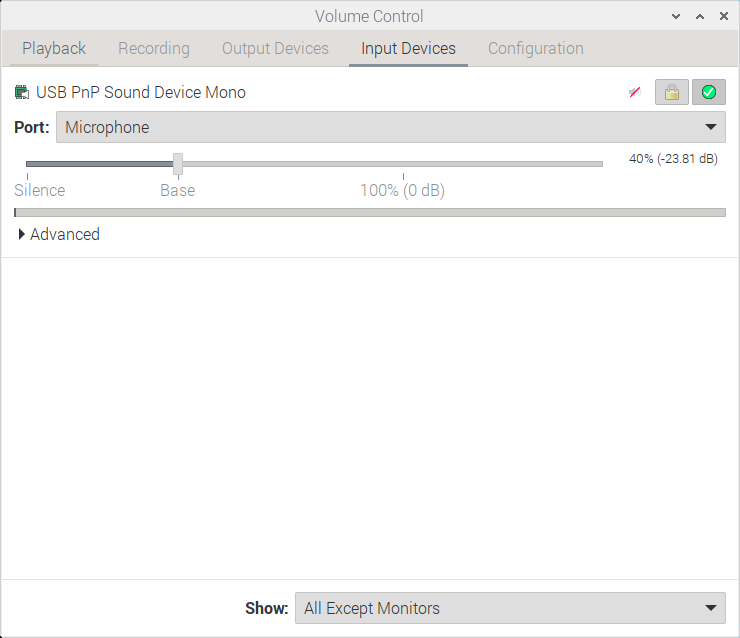

# QtSoundModem

QtSoundModem is a soundmodem with a GUI written by John Wiseman G8BPQ. It is a fork of UZ7HO Soundmodem.

It has some compelling features - not only does it natively understand IL2P at a number of different baud and bitrates and modulations, it supports multiple modems, each with a different KISS interface. This allows for up to 4 ports with different speeds, protocols and modes in the same channel - a fantastic thing to explore on HF.

## Software Set Up

### Installation

If you're using Debian, Ubuntu or a Raspberry Pi it will be easiest if you install [hibby's repo](../repo.md).

Once you have done that you can install the prerequisites, either search for qtsoundmodem in your [app store](linux.md/#graphical-app-store-frontend):

`sudo apt install qtsoundmodem`

## Configuation

Configuration is done through the menu system.

### Modem Configuration

Open Settings, then Setup modems, and face this menu:

Select 'IL2P Only' in the IL2P menu, and then run away.

## Debugging Strategies

First off, make sure you have your terminal open and at the bottom right it says 'KISS Connected' or 'AGW Connected' depending on how you've configured your interface from your soundmodem to terminal. 

### Receive Check

Sense check: are you hearing the remote station coming in to your radio? Have you heard it in the past? 

#### Check the radio

Let's work out what's changed if you've heard the remote station in the past. 

  * Are you on the right frequency? 
  * Are they experiencing a temporary outage / expected break? 
  * Is your antenna OK? 
  * Is it in the same place? 
  * Is it plugged in? 
  * Is the radio even on?
  * Is everything real or am I just living in a simulation? ...Wrong list of questions

#### Check the cable

Is the cable connected to both the radio and the computer - 

  * Are there any obvious breaks in the cable? 
  * Are the jacks at the computer end plugged in to the correct sockets?
  * Maybe just reseat the cable to check it's plugged in correctly.

#### Check the audio coming in is at the right volume

!!! note

    This shall use the Pulse Audio Volume Control program, which is an invaluable friend in wading through Linux audio problems. If it's not obvious where this is in your application launcher, you can open a terminal and type `pavucontrol`. If you don't have it, you should `sudo apt install pavucontrol`.

Open the input devices tab - does the VU bar of your soundcard show any activity? In the below screengrab, I have a little audio that is probably just background coming to my Built in soundcard. In many scenarios you'll be using a USB or external soundcard, it might be called a CM108 or similar - be sure you're looking at the right device. Low to no audio as I am showing indicates an issue or an error in the cable. It also might indicate your radio is squelched, be sure to check your squelch is off if possible.

!!! note
    If you have no audio coming in and your radio is unsquelched, double check your cable is ok (maybe with a volt meter, or remove and reconnect the ends). Check you are looking at the right soundcard, and check each jack is going to the correct socket on the soundcard.

If you receive a packet and the VU bar goes all the way or is very high, your incoming audio is too high - bring down that slider below the VU bar. If your incoming audio is too high, it might be distorting as the computer digitises it. Having it peak at half way should be more than enough volume.

This resolves to the following questions:

  * Is the computer receiving audio?
  * Is the received audio too high?

#### Check the audio coming in is going to the right application

As in the above segment, open Pulse Audio Volume Control but this time go to the 'Recording' Tab. You should see an entry for QtSoundModem, or Direwolf if that is your poison of choice!

The VU bar should show activity when a packet is received, just like the one in the Input Devices Tab. If not, you may need to change the device the audio is coming from - there will be a dropdown that lists all your computer's audio inputs and you can select. Again, there is a slider here for volume control - the effects of this are additional to that of the Input Tab, so dropping audio by 6dB in both locations will create a total drop of 12dB. Due to this, I generally recommend leaving it at 100% / 0dB and only modifying the Input Device slider.

If you have sorted routing, wait for more packet traffic to see if anything appears in your Terminal monitor pane.

To understand if QtSoundModem is receiving audio, you can look in the waterfall window within the application:

[insert image]

This resolves to the questions: 

  * Is the application receiving audio?
  * Is the correct soundcard selected  
  * Is the application audio too high or too low?

### Transmit Audio

#### Check the generated audio is going to the right soundcard

Open Pulse Audio Volume Control but this time go to the 'Playback' Tab. You should see an entry for QtSoundModem, or Direwolf if that is your poison of choice!

If your modem is not showing, check in the configuration to be sure it is outputting audio to 'Pulse'. In QtSoundModem, this will look as below:

The VU bar should show activity when a packet is transmitted, just like the one in the Input Devices Tab. If not, you may need to change the application volume, and double check the soundcard the application is being sent to. There will be a dropdown that lists all your computer's audio outputs and you can select. Again, there is a slider here for volume control - the effects of this are additional to that of the Output Devices Tab, so dropping audio by 6dB in both locations will create a total drop of 12dB. Due to this, I generally recommend leaving it at 100% / 0dB and only modifying the Output Devices slider.

If you have sorted routing, generate more packet traffic to see if anything appears in your Terminal monitor pane.

To understand if QtSoundModem is transmitting audio, you can look in the waterfall window within the application:

[insert image]

This resolves to the questions: 

  * Is the application registered in pulseaudio?
  * Is the correct soundcard selected
  * Is the application audio too high or too low?

#### Check the audio leaving is at the right volume

Open the Output Devices tab - does the VU bar of your soundcard show any activity? 

If you transmit a packet and the VU bar goes all the way or is very high, your outgoing audio is too high - bring down that slider below the VU bar. If your incoming audio is too high, it might be distorting as the radio modulates it. Having it peak at half way should be more than enough volume. If your radio has an ALC meter, use the slider to set an optimum level in that.

This resolves to the following questions:

  * Is the computer generating audio?
  * Is the generated audio too high?
